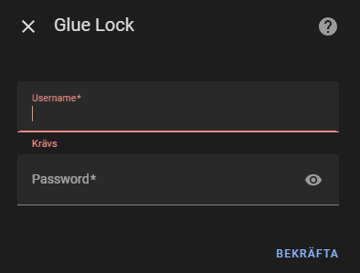
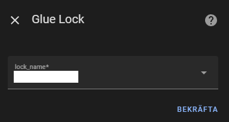

# Glue lock

[![GitHub Release][releases-shield]][releases]
[![GitHub Activity][commits-shield]][commits]
[![License][license-shield]](LICENSE)

[![pre-commit][pre-commit-shield]][pre-commit]
[![Black][black-shield]][black]

[![hacs][hacsbadge]][hacs]
[![Project Maintenance][maintenance-shield]][user_profile]

**This component will set up the following platforms.**

| Platform        | Description                                                               |
| --------------- | ------------------------------------------------------------------------- |
| `sensor`        | Current battery status |
| `button`        | Two buttons used for locking or unlocking |

Please note that I only had the first generation lock which did not have the lock status. If you have an newer lock with lock status available in your app and want to have it implemented. Please open an issue so we can investigate the API response for the lock status or if you want to can contribute yourself :)

## Manual installation

1. Using the tool of choice open the directory (folder) for your HA configuration (where you find `configuration.yaml`).
2. If you do not have a `custom_components` directory (folder) there, you need to create it.
3. In the `custom_components` directory (folder) create a new folder called `glue_lock`.
4. Download _all_ the files from the `custom_components/glue_lock/` directory (folder) in this repository.
5. Place the files you downloaded in the new directory (folder) you created.
6. Restart Home Assistant
7. In the HA UI go to "Configuration" -> "Integrations" click "+" and search for "Glue lock"

## Configuration is done in the UI

1. Enter your credentials (Same as the one you use in your mobile application)

2. Select the lock you want to setup in HA (List is populated automatically after login and shows all your glue locks that you have)

3. Setup is done! 

## Contributions are welcome!

If you want to contribute to this please read the [Contribution guidelines](CONTRIBUTING.md)

## Credits

This project was generated from [@oncleben31](https://github.com/oncleben31)'s [Home Assistant Custom Component Cookiecutter](https://github.com/oncleben31/cookiecutter-homeassistant-custom-component) template.

Code template was mainly taken from [@Ludeeus](https://github.com/ludeeus)'s [integration_blueprint][integration_blueprint] template

---

[integration_blueprint]: https://github.com/custom-components/integration_blueprint
[black]: https://github.com/psf/black
[black-shield]: https://img.shields.io/badge/code%20style-black-000000.svg?style=for-the-badge
[buymecoffee]: https://www.buymeacoffee.com/aniiik
[buymecoffeebadge]: https://img.shields.io/badge/buy%20me%20a%20coffee-donate-yellow.svg?style=for-the-badge
[commits-shield]: https://img.shields.io/github/commit-activity/y/aniiik/glue_lock_hass.svg?style=for-the-badge
[commits]: https://github.com/aniiik/glue_lock_hass/commits/main
[hacs]: https://hacs.xyz
[hacsbadge]: https://img.shields.io/badge/HACS-Custom-orange.svg?style=for-the-badge
[discord]: https://discord.gg/Qa5fW2R
[discord-shield]: https://img.shields.io/discord/330944238910963714.svg?style=for-the-badge
[exampleimg]: example.png
[forum-shield]: https://img.shields.io/badge/community-forum-brightgreen.svg?style=for-the-badge
[forum]: https://community.home-assistant.io/
[license-shield]: https://img.shields.io/github/license/aniiik/glue_lock_hass.svg?style=for-the-badge
[maintenance-shield]: https://img.shields.io/badge/maintainer-%40aniiik-blue.svg?style=for-the-badge
[pre-commit]: https://github.com/pre-commit/pre-commit
[pre-commit-shield]: https://img.shields.io/badge/pre--commit-enabled-brightgreen?style=for-the-badge
[releases-shield]: https://img.shields.io/github/release/aniiik/glue_lock_hass.svg?style=for-the-badge
[releases]: https://github.com/aniiik/glue_lock_hass/releases
[user_profile]: https://github.com/aniiik
